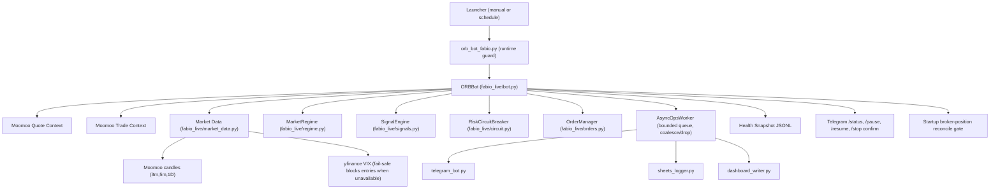
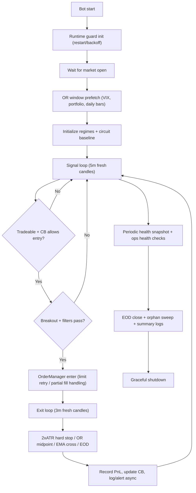

# Fabio Bot Architecture and Workflow

This document provides a high-level visual of the live system architecture and the intraday execution workflow.

Runtime session boundaries are evaluated in `America/New_York` and health snapshots are retained as local telemetry with rolling pruning.

## System Architecture

**Startup reconcile gate:** `ORBBot` runs `position_list_query` at init. With `FABIO_AUTO_ADOPT_OPEN_POSITIONS=1` (default), open option rows must be adoptable (valid US option code, positive qty, positive cost basis fields) or the bot may **pause entries** and log `STARTUP_PREFLIGHT` plus a stable `PauseReason` (see README “Startup paused: reconcile triage”). Day initialization can also pause with `vix_unavailable` if the VIX snapshot cannot be loaded.

## Trading-Day Workflow

