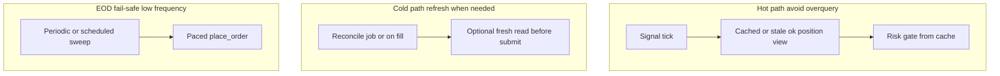

# API and rate discipline (Moomoo / OpenD)

Broker and gateway APIs have **frequency limits** and **latency**. Treating them gently keeps retries and throttles rare and avoids starving your own strategy loop.

## Checklist — workflow Section 6

1. **Batch non-critical reads** — Do not call `position_list_query` (or similar) on **every** signal tick unless you truly need fresh positions that often. Cache positions in the **truth / reconcile** path, refresh on a timer or on **fill** events, and reserve live queries for size checks right before submission when necessary.
2. **Space order submissions** — Insert a small delay between `place_order` calls when closing many legs so you respect **broker / API pacing**. Tune from the default if your broker feedback or logs show throttles.
3. **Explicit scopes for emergency paths** — Prefer a **narrow** scope (e.g. listed options only) for flatten and fail-safe jobs so you do not liquidate **unintended** books (long-term stock holds, other strategies). Use **broad** scope only deliberately.

**Efficiency win:** Fewer throttles, less OpenD load, and smaller blast radius on emergency tools.

## Main bot vs fail-safe

| Concern | Main strategy loop | [`moomoo_eod_failsafe.py`](../../backend/moomoo_eod_failsafe.py) |
|--------|--------------------|------------------------------------------------------|
| Position reads | Prefer **batched / low frequency** | Default: **refresh before each close** for idempotency (more reads, **rare** cadence—once per EOD sweep). **`--no-refresh-per-order`**: fewer reads, weaker vs partial fills. |
| Order pacing | Slice or space if sending many orders | **`--sleep-between-orders`** (default **0.35** s; optional env **`MOOMOO_SLEEP_BETWEEN_ORDERS`**) |
| Scope | N/A | **`--scope options`** (default) vs **`all`** — only widen when you mean to flatten everything closable |

## Diagram

## Environment / flags (this repo)

| Mechanism | Purpose |
|-----------|---------|
| `MOOMOO_SLEEP_BETWEEN_ORDERS` | Default seconds between orders if set (float; falls back to **0.35**) |
| `--sleep-between-orders` | Override spacing per run |
| `--scope options` / `all` | Limit what the fail-safe may close |
| `--no-refresh-per-order` | Fewer `position_list_query` calls within one sweep |

Follow **Moomoo OpenAPI** documented limits for your subscription; this doc does not replace their rate tables.

See also: [OpenD as a shared dependency](architecture-opend-shared-dependency.md), [Idempotency and EOD flatten](architecture-idempotency-eod-flatten.md), [Observability](architecture-observability.md), [Repository and workflow hygiene](architecture-repository-hygiene.md).
