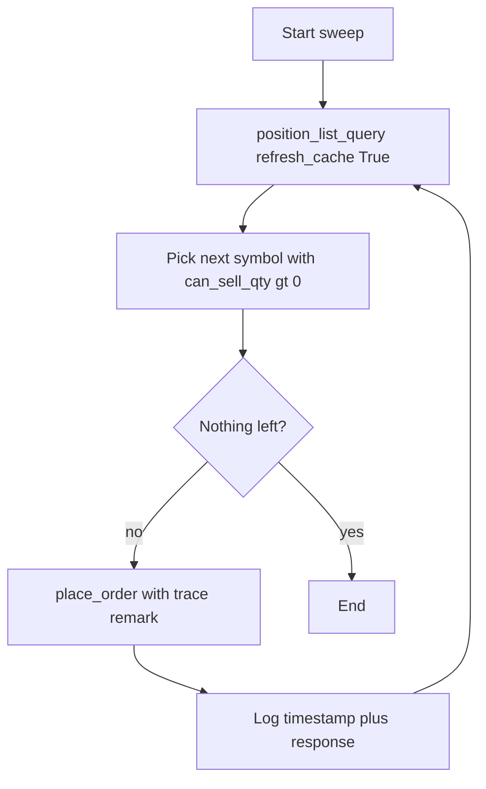

# Idempotency and at-most-once flatten (EOD sweeps)

EOD sweeps should assume **retries** (network blips, partial fills, scheduler double-fires). Design for **detectable, recoverable** behavior so one partial failure does not leave you guessing what the broker has.

## Checklist — workflow Section 4

1. **Re-query before each close** — Before placing a close, refresh positions (`refresh_cache=True` pattern). A single snapshot at the start is not enough if earlier orders filled, partially filled, or failed and you retry the same run.
2. **Deterministic traces** — Use **deterministic `remark`** strings (and broker **client order IDs** when the API exposes them) so duplicate submissions or replays are **visible** in order history and logs.
3. **Log every attempt** — Log each close attempt with **timestamp** and **broker response** (success payload or error).

**Efficiency win:** Less manual cleanup after partial failures.

## Diagram

## This repository

[`moomoo_eod_failsafe.py`](../../backend/moomoo_eod_failsafe.py) implements:

- **Per-symbol refresh** before each `place_order` (after the initial discovery pass), so qty reflects the latest broker state.
- **`remark`** values including a **run id** and sequence (`eod_fs_<runId>_<seq>`), clamped to the API **64-byte** remark limit.
- **Stdout/stderr lines** prefixed with an **ISO-8601 UTC timestamp** for each position refresh skip, order attempt, and broker result (human format), or **`--log-format jsonl`** for one JSON object per line (`component`, `event`, `symbol`, `decision`, `reason_code`, `latency_ms`, `level`).

Broker-specific client order ID fields depend on Moomoo API/SDK versions—use `remark` plus logs as the portable trace.

See also: [Scheduling and time semantics](architecture-scheduling-time-semantics.md), [Narrow pipelines](architecture-narrow-pipelines.md), [Observability](architecture-observability.md), [API and rate discipline](architecture-api-rate-discipline.md).
