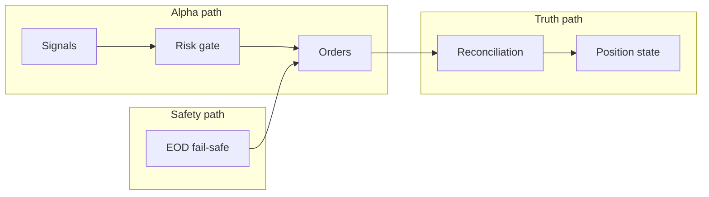

# Narrow pipelines: separation of concerns

Keep three paths **loosely coupled** so one failure does not stall everything.

## Diagram

- **Alpha path:** intent from signals → risk approval → outbound orders.
- **Truth path:** broker fills and snapshots → reconciliation → authoritative internal position state.
- **Safety path:** scheduled or triggered flatten (e.g. post–EOD sweep) issues **close** orders through the same execution surface as the Alpha path (`Ord`), without replacing ongoing signal logic.

## Principles

1. **Signal generation** should not block on broker round-trips where avoidable: compute intents first; validate against **cached** risk limits when possible.

2. **Execution** should be a **thin adapter**: translate intent → orders; handle retries and idempotency in one place.

3. **Reconciliation** (broker truth vs internal state) should run on its **own cadence** or on **fill events**, not inside every signal tick.

**Efficiency:** Less coupling → fewer stalls when OpenD, the network, or the broker is slow.

## This repository today

| Pipeline | What lives here |
|----------|-----------------|
| Alpha path | Not in this workspace (strategy runs elsewhere; CSV mirrors may reflect outputs). |
| Truth path | Optional: ingest broker/`position_list_query` elsewhere; CSVs are historical artifacts, not live truth. |
| Safety path | [`moomoo_eod_failsafe.py`](../../backend/moomoo_eod_failsafe.py) — broker sweep after EOD; scope via `--scope options` or `all`. |

Align any future bot code with the three paths above so reconciliation and safety do not share the hot loop with alpha generation.

See also: [System context](architecture-system-context.md), [Bot integration checklist](bot-integration-checklist.md), [OpenD as a shared dependency](architecture-opend-shared-dependency.md), [Scheduling and time semantics](architecture-scheduling-time-semantics.md), [API and rate discipline](architecture-api-rate-discipline.md), [Repository and workflow hygiene](architecture-repository-hygiene.md).
