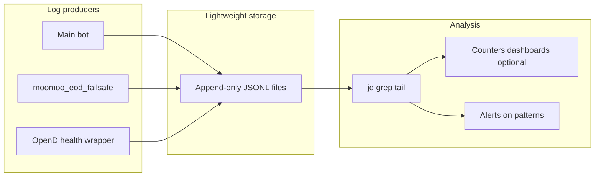

# Observability (live efficiency)

Static architecture diagrams help onboarding; **live efficiency** improves when you can see what the stack is doing without spelunking ad‑hoc prints.

## Checklist — workflow Section 5

1. **Structured logs** — Prefer fields you can filter on: `component`, `event`, `symbol`, `decision`, `reason_code`, `latency_ms`, plus any extra context. **JSON Lines** (one JSON object per line) is a low‑ceremony format that works with `grep`, `jq`, and log aggregators.
2. **Counters** — Track rates over time: orders **submitted** vs **rejected**, **reconcile mismatches** (internal vs broker), **OpenD disconnects** / reconnects. These can start as daily greps on JSONL files before you add Prometheus/Datadog.
3. **Alerts** — Examples: no **heartbeat** from the main bot, reconcile **drift** above a threshold, **fail-safe fired** (so you know emergency flatten ran). Wire alerts to whatever you already use (email, Slack, PagerDuty).

You do **not** need a heavy stack at first: **append-only JSON lines** + `tail` / `grep` / `jq` is enough to spot bottlenecks (for example: “risk gate waits 2s every tick because we hit the broker every tick”).

## Fail-safe script in this repo

[`moomoo_eod_failsafe.py`](../../backend/moomoo_eod_failsafe.py) supports:

- `--log-format human` (default) — timestamped text lines.
- `--log-format jsonl` — one JSON object per line with `component`, `event`, `symbol` (where applicable), `decision`, `reason_code`, `latency_ms` (where measured), and `message`; errors include `"level":"error"`.

Example (append for later analysis). **Note:** The Moomoo SDK may still print connection lines to stderr; filter with ``grep '^{'`` or run with stderr redirected if you need pure JSONL:

```bash
python3 backend/moomoo_eod_failsafe.py --log-format jsonl --dry-run 2>/dev/null | tee -a eod_failsafe.jsonl
# or: MOOMOO_LOG_FORMAT=jsonl
```

Main trading bots should use the same **field names** where possible so one `jq` query spans components.

## Diagram



See also: [System context](architecture-system-context.md), [Bot integration checklist](bot-integration-checklist.md), [Scheduling and time semantics](architecture-scheduling-time-semantics.md), [Idempotency and EOD flatten](architecture-idempotency-eod-flatten.md), [Narrow pipelines](architecture-narrow-pipelines.md), [OpenD as shared dependency](architecture-opend-shared-dependency.md), [API and rate discipline](architecture-api-rate-discipline.md), [Repository and workflow hygiene](architecture-repository-hygiene.md).

Optional: [`scripts/summarize_failsafe_jsonl.sh`](../../scripts/summarize_failsafe_jsonl.sh) (`jq`) aggregates events from a JSONL file—see [README.md](../../README.md#summarize-jsonl-logs-optional).

## Appendix: jq recipes for fail-safe JSONL

Use these on files written by [`moomoo_eod_failsafe.py`](../../backend/moomoo_eod_failsafe.py) with `--log-format jsonl`. Lines must be one JSON object per line; if the file is mixed with non-JSON noise, pipe through `grep '^{'` first.

**Count `place_order_end` rows by `reason_code`:**

```bash
grep '^{' eod_failsafe.jsonl | jq -r 'select(.event == "place_order_end") | .reason_code' | sort | uniq -c
```

**Show the last `run_complete` event (end of a sweep):**

```bash
grep '^{' eod_failsafe.jsonl | jq 'select(.event == "run_complete")' | tail -n 1
```

**List failed closes (`place_order_end` where `reason_code` is not `ok`):**

```bash
grep '^{' eod_failsafe.jsonl | jq 'select(.event == "place_order_end" and .reason_code != "ok")'
```

Optional: median `latency_ms` for `place_order_end` on a given day — adapt the file name or add `select(.ts | startswith("2026-05-08"))` if you log multiple days in one file.
