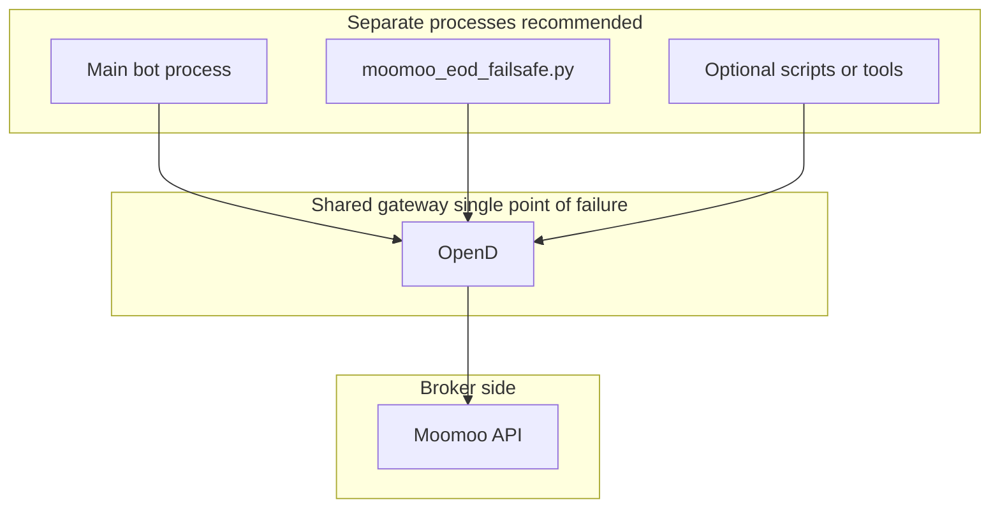

# OpenD as a shared dependency

OpenD is the **TCP gateway** between your programs and Moomoo’s API. It is **not** the trading bot itself—it is infrastructure every client shares.

## Diagram

Throughput: for typical retail option automation, one OpenD instance is usually **not** the limiting factor versus liquidity, spreads, or rate limits.

Reliability: all clients depend on **one** gateway—if OpenD is down or not logged in, **every** path that uses the API fails together.

## Recommendations

1. **Supervise OpenD**  
   Run it under a supervisor (launchd, systemd, Docker restart policy, etc.): restart on crash, **alert** if the listen port is closed or the process exits.

2. **Separate processes**  
   Keep the **main strategy loop** and **`moomoo_eod_failsafe.py`** as **different processes/jobs**. If the bot hangs, the scheduled EOD job can still run **as long as OpenD stays healthy**.

3. **Connection hygiene in hot loops**  
   Avoid repeatedly creating and destroying **trade contexts** inside tight loops. Prefer **long-lived** contexts and **batch** position/order reads where the SDK allows, so you do not amplify load on OpenD during busy ticks.

## This repository

- Fail-safe client: [`moomoo_eod_failsafe.py`](../../backend/moomoo_eod_failsafe.py) — runs as its own process (e.g. cron/launchd after EOD).

Related: [architecture-narrow-pipelines.md](architecture-narrow-pipelines.md), [architecture-scheduling-time-semantics.md](architecture-scheduling-time-semantics.md), [API and rate discipline](architecture-api-rate-discipline.md).
