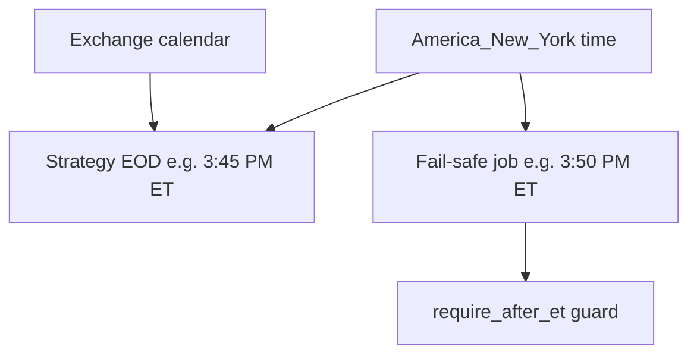

# Scheduling and time semantics (US cash equities and options)

Session logic and safety jobs should use **unambiguous time rules**, not only the machine’s local timezone.

## Checklist — workflow Section 3 (US cash equities / options)

1. **Session decisions** — Align “session decision” clocks with **US/Eastern** and the **exchange calendar** (early closes, holidays). Do **not** rely only on the local machine timezone.
2. **Fail-safe** — Keep **`--require-after-et`** (or equivalent) so accidental **daytime** runs do not flatten positions. Schedule the fail-safe **a few minutes after** your intended EOD close (e.g. **3:50 PM ET** after primary close at **3:45 PM ET**) to absorb lag and let primary closes settle.
3. **Efficiency win** — Fewer mistaken runs and fewer duplicate flatten attempts.

## Session and decision clocks

- Use **US/Eastern** (`America/New_York`) for **session decisions** (regular hours, scheduled exits, fail-safe windows). Wall-clock ET includes **DST**; do not assume a fixed UTC offset year-round.
- Align behavior with the **NYSE/Nasdaq calendar**: **regular holidays**, **early closes** (e.g. day before Independence Day, Black Friday), and any **halts** your policy cares about. A static “weekday” check is not enough for “is today a full session?”.
- Prefer a **session calendar** in code or data (e.g. exchange calendar from a maintained library or vendor list) instead of “is it Monday–Friday on my laptop?”

**Efficiency / safety:** Fewer false assumptions → fewer trades or flatten runs on the wrong day.

## Diagram

## Fail-safe timing (this repository)

[`moomoo_eod_failsafe.py`](../../backend/moomoo_eod_failsafe.py) supports:

- **`--require-after-et`** — abort unless it is a **US/Eastern weekday** and the current **ET** time is **after** the cutoff (see next items). Use this so a mis-scheduled **daytime** run does not flatten the book.
- **`--cutoff-et-hour`** / **`--cutoff-et-minute`** — default **15:45** (3:45 PM ET).

**Operational pattern**

1. **Primary EOD:** Strategy or primary workflow runs **normal close procedures** at **3:45 PM ET** (or your chosen time). That is the intended exit path.
2. **Fail-safe only:** Schedule [`moomoo_eod_failsafe.py`](../../backend/moomoo_eod_failsafe.py) **a few minutes later** (e.g. **3:50 PM ET**) to **scan Moomoo for any positions still open** and force-close leftovers—not to replace step 1. The delay lets normal closes finish and state settle; `--require-after-et` still blocks accidental daytime runs when cutoff is 3:45 ET.

## Non-interference: 3:50 fail-safe vs primary 3:45 EOD

**Requirement:** The 3:50 fail-safe **must not interfere** with the primary 3:45 EOD.

| Rule | Why |
|------|-----|
| **Two separate scheduled jobs or processes** | The fail-safe is **not** invoked from inside the primary EOD path and does **not** share one blocking “mega script” with it. |
| **3:50 runs only after 3:45 has had time to complete** | Schedule 3:50 **several minutes after** 3:45 (not at the same minute). That avoids racing the primary close and gives working orders time to fill or cancel on the primary side. |
| **`--require-after-et` with cutoff 15:45** | Prevents the fail-safe from running **before** 3:45 ET on a mistaken trigger; it does not shorten or pre-empt the primary window. |
| **Fail-safe does not replace primary logic** | It only runs a **broker snapshot** and closes **residual** positions. It does not cancel or rewrite primary EOD decisions; design the primary job so it completes without depending on the fail-safe. |
| **No shared in-process lock** | If both use OpenD, they are concurrent-capable **clients**; do not serialize them in one process so a hung primary blocks the fail-safe (or vice versa) unless you intentionally orchestrate that. |

**Efficiency win:** Fewer mistaken flatten runs and fewer duplicate emergency closes fighting your main EOD path.

## Multiple scheduled procedures (keep them separate)

Run **each** time-based step as its **own** scheduled job or process (e.g. separate `launchd`/`cron` entries, or separate workflow steps)—**not** one mega-script that chains everything unless you deliberately want that coupling.

| Time (example) | Role | Separation |
|----------------|------|------------|
| **3:45 PM ET** | Primary EOD close | Own job / strategy path |
| **3:50 PM ET** | Moomoo fail-safe scan + force-close | **Different** job from 3:45; starts **after** intentional closes |
| **Later (e.g. 4:45 PM ET)** | Whatever you run next—reports, reconcile, exports, extended-hours logic | **Different** job again |

Why this matters:

- The **3:50** script should **not** be embedded inside a **4:45** (or 3:45) routine as a subroutine that could skip or block the later step—schedule **3:50 independently** so it cannot hold up or swallow errors from your **4:45** procedure.
- If **4:45** also talks to OpenD/Moomoo, two jobs **back-to-back** (3:50 then 4:45) are fine: separate processes, OpenD handles one connection at a time for requests—just avoid **starting** the 4:45 job until 3:50 has **finished** if 4:45 depends on flat positions (stagger by a few minutes or use exit codes / logs).
- If **4:45** is **non-trading** (CSV rollups, email, no broker API), there is no trading conflict with 3:50; still keep jobs separate for clarity and retries.

If you actually meant **3:45** (primary EOD) vs **3:50** (fail-safe): they are **already** separate procedures by design—ensure they are **two schedules**, not one blocking chain. **The 3:50 job must not run inside or before the primary 3:45 EOD** (see [Non-interference](#non-interference-350-fail-safe-vs-primary-345-eod) above).

## This repository

| Item | Where |
|------|--------|
| ET guard and cutoff | `moomoo_eod_failsafe.py` (`--require-after-et`, `--cutoff-et-hour`, `--cutoff-et-minute`) |
| Main strategy EOD | Not in this workspace; keep its schedule and the fail-safe offset consistent in your runbook |

See also: [Narrow pipelines](architecture-narrow-pipelines.md), [OpenD as a shared dependency](architecture-opend-shared-dependency.md), [Idempotency and EOD flatten](architecture-idempotency-eod-flatten.md), [Observability](architecture-observability.md), [API and rate discipline](architecture-api-rate-discipline.md), [Repository and workflow hygiene](architecture-repository-hygiene.md), [System context](architecture-system-context.md).
