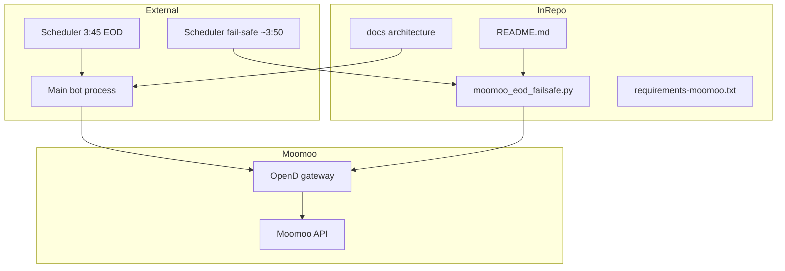

# System context (as-built vs external)

This page is the **single map** of what lives **in this repository**, what runs **outside** it, and how it connects to **Moomoo**. Edit the placeholders when your bot path, hostnames, or schedules are finalized.

## Placeholders (edit in Git)

| Item | Value (fill in) |
|------|------------------|
| Main strategy bot | e.g. repo path, service name, or *TBD* |
| Machine running OpenD | e.g. *localhost*, Mac mini hostname, VPS |
| Primary EOD close | **3:45 PM ET** (intentional strategy exits) |
| Fail-safe sweep | **~3:50 PM ET** (separate job; Moomoo flatten of leftovers; must not run before primary completes) |

## As-built diagram

- **InRepo:** versioned fail-safe, SDK bounds, runbook, architecture docs (no live strategy loop here today unless you add it).
- **External:** primary trading process and its schedule; must stay **loosely coupled** from the fail-safe process ([narrow pipelines](architecture-narrow-pipelines.md), [non-interference](architecture-scheduling-time-semantics.md)).
- **Moomoo:** OpenD is the **shared** TCP gateway; both bot and fail-safe depend on it when using the OpenAPI.

## Related runbook

- Root: [README.md](../../README.md) — dry-run, `MOOMOO_*` vars, escalation template.
- Hygiene: [architecture-repository-hygiene.md](architecture-repository-hygiene.md).
- External bot: [bot-integration-checklist.md](bot-integration-checklist.md).

## See also

- [OpenD as a shared dependency](architecture-opend-shared-dependency.md)  
- [Scheduling and time semantics](architecture-scheduling-time-semantics.md)  
- [Observability](architecture-observability.md)  
